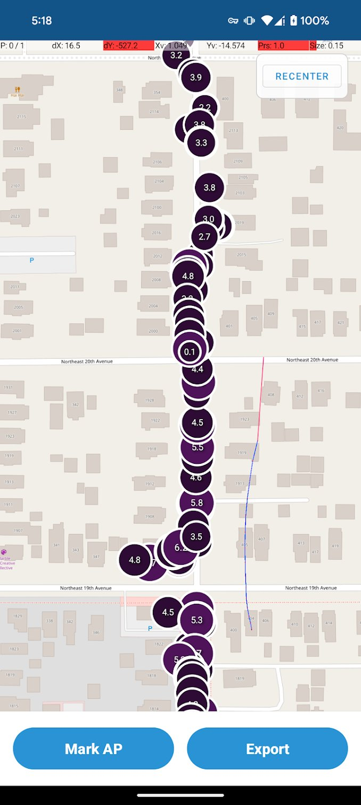
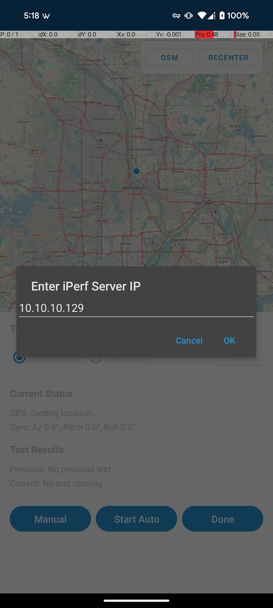
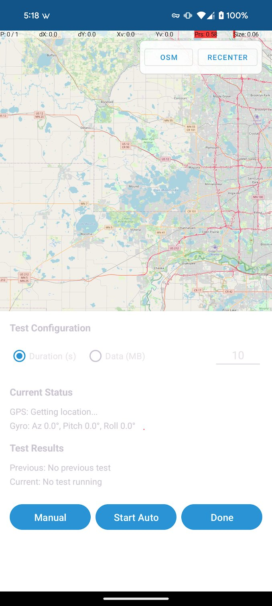

# GPS Speed Test App

Android app for testing network performance with GPS tracking and device orientation data.

## Features

- **Network Speed Testing** using iPerf3 protocol
- **GPS Location Tracking** with high accuracy
- **Device Orientation Capture** (azimuth, pitch, roll)
- **Interactive Map Visualization** with satellite imagery
- **Session Management** for multiple test runs
- **CSV Export** for data analysis

## Screenshots

### 1. Main Screen

Interactive satellite map showing speed test results as colored circles. Each session gets a unique color, with circle size indicating speed.

### 2. Server Setup

Configure your iPerf3 server IP address and view real-time GPS/orientation data.

### 3. Test Configuration

Choose between duration-based or data-based testing modes and run manual or auto tests.

### 4. Export Screen

Manage test sessions - select, delete, or export to CSV format.

## Installation

**Option 1: Direct APK (Recommended)**
1. Download [GPS Speed Test APK](./app-release.apk)
2. Enable "Install from Unknown Sources" in Android Settings
3. Install the APK

**Option 2: Build from Source**
```bash
git clone https://github.com/yourusername/GPSSpeedTest.git
./gradlew installDebug
```

## Quick Start

1. Grant location permissions
2. Tap "Mark AP" → Enter iPerf3 server IP
3. Configure test parameters (duration/data)
4. Run tests manually or in auto mode
5. Export results to CSV

## iPerf3 Server Setup

**Linux/macOS:**
```bash
sudo apt-get install iperf3  # or brew install iperf3
iperf3 -s -p 5201
```

**Windows:**
Download from https://iperf.fr/iperf-download.php
```bash
iperf3.exe -s -p 5201
```

## CSV Export Data

**Session Info:** ID, description, start time, server, duration, AP location
**Test Results:** Timestamp, GPS coordinates, speed (Mbps), distance from AP, orientation (azimuth/pitch/roll), accuracy

## Troubleshooting

**GPS Issues:** Enable location permissions, test outdoors
**iPerf3 Connection Failed:** Check server is running, verify firewall settings
**Map Not Loading:** Check internet connection, clear app data

## Tech Stack

- **Kotlin** with Room database
- **OSMDroid** for offline mapping
- **Material Design** components
- **Custom iPerf3** client implementation

## License
If you're making money off this I should be making money off this, otherwise get buckwild.
